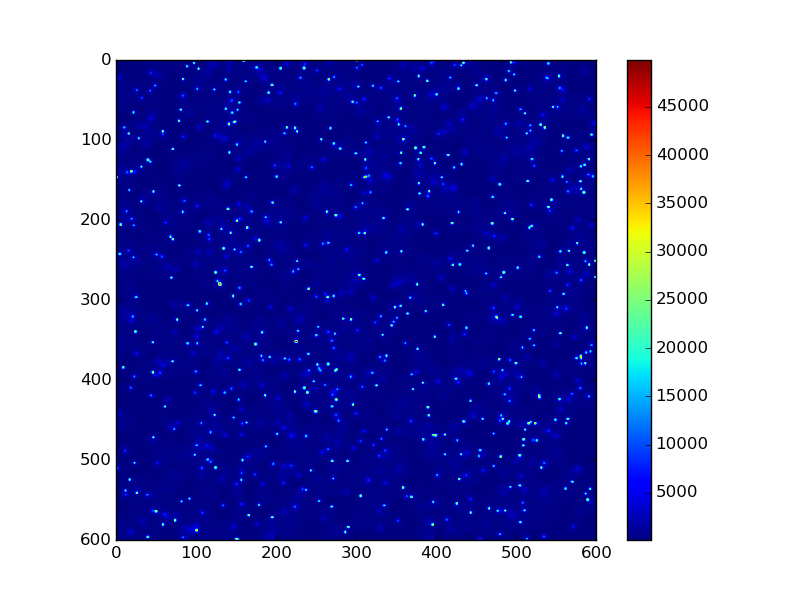

microscope
==========

```
$ cmake .
$ make
$ ./main
$ python plot.py
```

```
$ g++ generate_table.cpp -lgsl -lcblas
$ ./a.out
$ g++ main.cpp -lgsl -lcblas
$ ./a.out
$ python plot.py
```

```
$ g++ -Icubature-1.0.2 -DCUBATURE main.cpp cubature-1.0.2/hcubature.c -lgsl -lcblas
```

```
$ OMP_NUM_THREADS=5 ./main test*.csv
```

```
$ cmake .
$ make psf_tables
$ python setup.py build_ext --inplace
$ python sample.py
```


